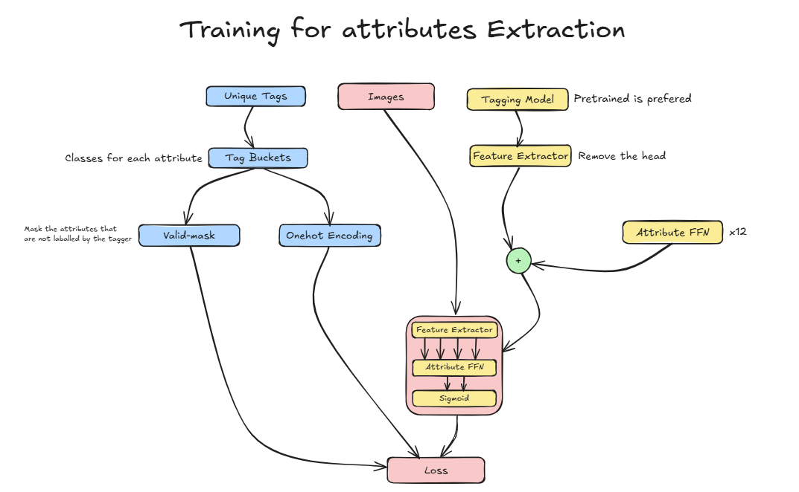

# Who's the character?

This project identifies characters in images using a combination tagging and a **Vision-Language Model (VLM)** for recognition.

It includes two processing pipelines:
- **Pipeline 1 (VLM only)**: Directly classifies characters.
- **Pipeline 2 (Tagger + VLM)**: First extracts tags using DeepDanbooru, then uses VLM for recognition.
- **Pipeline 3 (Hierarchical Tag Classifier)**: First extracts tags using DeepDanbooru, then uses VLM for recognition.

## Installation

To set up the environment, execute the following commands:

```bash
pip3 install torch torchvision --index-url https://download.pytorch.org/whl/cu118
pip install autoroot autorootcwd
pip3 install -r requirements.txt
pip install dghs-imgutils
```

To clone and install DeepDanbooru:

```bash
git clone https://github.com/KichangKim/DeepDanbooru.git
cd DeepDanbooru
pip install .
cd ..
```

### Pipeline 1: VLM

```bash
python gradio_apps/gradio_pipe1_app2.py
```

| Input Image | Accuracy | Time (seconds) |
|:------------|---------:|---------------:|
| 1           |        8 |         17.56  |
| 2           |        9 |         15.09  |
| 2           |        9 |         15.09  |
| 3           |        8 |         14.43  |
| 4           |       10 |         13.11  |
| 5           |        9 |         13.75  |
| 6           |       11 |          9.75  |
| 7           |        9 |         11.79  |
| 8           |       10 |         13.11  |
| 9           |       11 |          9.58  |
| 10          |       12 |         16.44  |
| 11          |        7 |         31.60  |
| 12          |       10 |         12.35  |
| 13          |        9 |         13.80  |
| 14          |       10 |         13.24  |
| 15          |        7 |         14.52  |
| **Average** |        9 |         14.67  |

### Pipeline 2: Tagger + VLM

```bash
python gradio_apps/gradio_pipe2_app1.py
```
### App Look and Feel
<video controls>
  <source src="asset/app_screen.mp4" type="video/mp4">
  Your browser does not support the video tag.
</video>


| Input Image | Accuracy | Time (seconds) |
|:------------|---------:|---------------:|
| 1           |       10 |         10.81  |
| 2           |       11 |          8.01  |
| 3           |       11 |          9.38  |
| 4           |        8 |          7.97  |
| 5           |       11 |          8.39  |
| 6           |       12 |          8.96  |
| 7           |       12 |         10.19  |
| 8           |       11 |          9.16  |
| 9           |        8 |          6.85  |
| 10          |       12 |         11.17  |
| 11          |       11 |         10.79  |
| 12          |       11 |          6.84  |
| 13          |       12 |          8.16  |
| 14          |       11 |          6.79  |
| 15          |       11 |          8.03  |
| **Average** |     10.8 |          8.77  |

### Pipeline 3: Hierarchical Tag Classifier

Explaination: https://excalidraw.com/#json=Y2cmssKYInlBvyamFVH9i,YbsOkhYupIQKbxu98DIh9g


